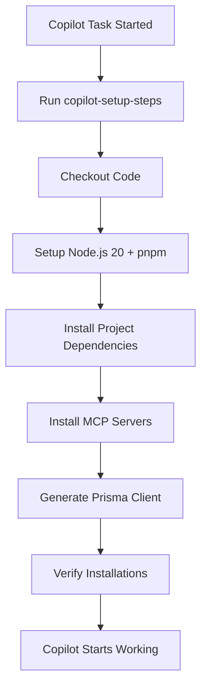

# GitHub Copilot Setup Steps - MCP Server Integration

> **Created**: November 2, 2025  
> **Purpose**: Pre-install MCP (Model Context Protocol) servers in Copilot's ephemeral environment

---

## Overview

This workflow configures GitHub Copilot's ephemeral development environment by pre-installing MCP servers and project dependencies. When Copilot Coding Agent starts working on tasks, these tools will already be available, enabling enhanced context and capabilities.

## What is `copilot-setup-steps.yml`?

The `.github/workflows/copilot-setup-steps.yml` file is a **special GitHub Actions workflow** that runs **before** Copilot Coding Agent starts working. It:

1. **Runs automatically** when Copilot starts a task
2. **Pre-installs tools** so Copilot doesn't have to discover/install them via trial-and-error
3. **Sets up the environment** with all necessary dependencies
4. **Improves performance** by eliminating slow LLM-based dependency discovery

## Installed MCP Servers

The workflow installs the following MCP servers:

### 1. **Context7 MCP** (`@upstash/context7-mcp`)
- **Purpose**: Fetch official library documentation
- **Use Cases**: Get up-to-date docs for Next.js, React, Prisma, MUI, Tailwind, etc.
- **Priority**: **MANDATORY FIRST STEP** per AGENTS.md
- **Installation**: `npx -y @upstash/context7-mcp install`

### 2. **Prisma MCP** (`@prisma/mcp-server-prisma`)
- **Purpose**: Prisma schema reasoning, migrations, and CLI operations
- **Use Cases**: Database schema changes, migration planning, Prisma Client generation
- **Installation**: `npm install -g @prisma/mcp-server-prisma`

### 3. **GitHub MCP** (`@modelcontextprotocol/server-github`)
- **Purpose**: Access GitHub issues, PRs, and repository context
- **Use Cases**: Reading issue details, creating PRs, commenting on issues
- **Installation**: `npm install -g @modelcontextprotocol/server-github`

### 4. **Filesystem MCP** (`@modelcontextprotocol/server-filesystem`)
- **Purpose**: File operations and workspace navigation
- **Use Cases**: Reading files, searching codebase, file structure analysis
- **Installation**: `npm install -g @modelcontextprotocol/server-filesystem`

### 5. **Playwright MCP** (`@playwright/mcp-server`)
- **Purpose**: E2E test generation and browser automation
- **Use Cases**: Creating Playwright tests, browser inspection, test fixtures
- **Installation**: `npm install -g @playwright/mcp-server`

### 6. **Next DevTools MCP** (`next-devtools-mcp`) ✅
- **Purpose**: Next.js 16 diagnostics, codemods, and runtime information
- **Use Cases**: Upgrades, build diagnostics, Cache Components setup
- **Installation**: **Already in package.json** (installed via `pnpm install`)

### 7. **Serena MCP** (`serena`)
- **Purpose**: Symbol-aware code navigation and editing
- **Note**: Serena is configured locally in `.serena/project.yml` - not installed via this workflow
- **Use Cases**: Code analysis, refactoring, memory management

## How It Works

### Workflow Triggers

The workflow runs in three scenarios:

1. **When Copilot starts a task** - Automatically by GitHub
2. **When the workflow file changes** - On push/PR to validate changes
3. **Manual trigger** - From the repository's Actions tab

### Execution Flow



### Workflow Configuration

```yaml
jobs:
  copilot-setup-steps:  # MUST be named exactly this
    runs-on: ubuntu-latest
    permissions:
      contents: read  # Minimum permissions
    steps:
      # Setup steps here
```

**Key Constraints** (per GitHub docs):
- Job **MUST** be named `copilot-setup-steps`
- Only certain properties can be customized:
  - ✅ `steps`, `permissions`, `runs-on`, `services`, `snapshot`, `timeout-minutes` (max 59)
  - ❌ Other properties are ignored
- Must be on **default branch** to activate

## Usage

### Validating the Workflow

1. **Automatic validation** - Push changes to the workflow file:
   ```bash
   git add .github/workflows/copilot-setup-steps.yml
   git commit -m "feat: add Copilot MCP setup workflow"
   git push origin main
   ```

2. **Manual testing** - Go to repository's Actions tab:
   - Navigate to: `https://github.com/yukimura-ixa/school-timetable-senior-project/actions`
   - Select "Copilot Setup Steps" workflow
   - Click "Run workflow"
   - Monitor execution and check logs

### Monitoring Copilot Sessions

When Copilot starts working:
1. Setup steps will run first
2. Progress shows in **session logs**
3. If setup fails (non-zero exit code), Copilot continues with current environment state
4. Check logs at: GitHub → Copilot sessions → View session details

### Environment Variables

To set environment variables for Copilot:

1. Go to Repository Settings → Environments
2. Create/select `copilot` environment
3. Add secrets or variables:
   - **Secrets**: Sensitive data (API keys, passwords)
   - **Variables**: Non-sensitive configuration

Example secrets to add:
- `DATABASE_URL` - Postgres connection string
- `AUTH_SECRET` - Auth.js secret key
- `AUTH_GOOGLE_ID` - Google OAuth client ID
- `AUTH_GOOGLE_SECRET` - Google OAuth client secret

## Troubleshooting

### Common Issues

**Issue**: Workflow doesn't run when Copilot starts
- **Solution**: Ensure file is on **default branch** (main)
- **Check**: File must be at `.github/workflows/copilot-setup-steps.yml` exactly

**Issue**: MCP server installation fails
- **Solution**: Check `continue-on-error: true` allows workflow to proceed
- **Debug**: View workflow run logs in Actions tab

**Issue**: Prisma Client generation fails
- **Solution**: Ensure `DATABASE_URL` secret is set in `copilot` environment
- **Note**: This step has `continue-on-error: true` to prevent blocking

**Issue**: Permissions errors
- **Solution**: Verify `contents: read` permission is set
- **Note**: Copilot gets its own token for operations after setup

### Error Handling Strategy

All MCP installation steps use `continue-on-error: true`:
- Allows workflow to complete even if individual MCPs fail
- Copilot can still work with available tools
- Check verification step output to see what succeeded

## Performance Considerations

### Before This Workflow
- Copilot discovers dependencies via trial-and-error (slow, unreliable)
- Each task may require re-installing tools
- LLM non-determinism can cause failures

### After This Workflow
- All tools pre-installed (fast, reliable)
- Copilot immediately has full context
- Deterministic environment setup

### Resource Usage
- **Run time**: ~2-5 minutes (one-time per Copilot task)
- **Disk space**: ~500MB for all MCP servers + node_modules
- **Network**: Downloads from npm registry during setup

## Customization

### Adding More MCP Servers

To add a new MCP server:

```yaml
- name: Install <MCP Name>
  run: |
    echo "Installing <MCP> for <purpose>..."
    npm install -g <package-name>
  continue-on-error: true
```

### Using Larger Runners

For better performance (more RAM/CPU):

```yaml
copilot-setup-steps:
  runs-on: ubuntu-4-core  # or ubuntu-8-core, ubuntu-16-core
```

**Note**: Requires GitHub Team or Enterprise plan for larger runners.

### Setting Timeout

Prevent long-running setups:

```yaml
copilot-setup-steps:
  timeout-minutes: 30  # Max: 59 minutes
```

## Integration with AGENTS.md

This workflow aligns with the **MCP-First Workflow** defined in `AGENTS.md`:

1. ✅ **Context7 MCP** - Installed (MANDATORY FIRST STEP)
2. ✅ **Serena** - Configured locally (not workflow-installed)
3. ✅ **Next DevTools MCP** - Installed via package.json
4. ✅ **Prisma MCP** - Installed globally
5. ✅ **GitHub MCP** - Installed globally
6. ✅ **Filesystem MCP** - Installed globally
7. ✅ **Playwright MCP** - Installed globally

### Context7-First Protocol

Per AGENTS.md, Copilot should:
1. Query Context7 **before** writing code
2. Resolve library IDs
3. Fetch official documentation
4. Implement using authoritative patterns

**This workflow ensures Context7 is available!**

## Related Documentation

- **GitHub Docs**: [Customize Copilot coding agent's environment](https://docs.github.com/en/copilot/how-tos/use-copilot-agents/coding-agent/customize-the-agent-environment)
- **AGENTS.md**: AI agent handbook for this project
- **copilot-instructions.md**: Copilot configuration and MCP routing
- **Workflow syntax**: [GitHub Actions workflow syntax](https://docs.github.com/en/actions/using-workflows/workflow-syntax-for-github-actions)

## Security Notes

### Permissions
- Workflow uses **minimal permissions** (`contents: read`)
- Copilot gets **separate token** for its operations
- No write access to repository during setup

### Secrets Handling
- Use `copilot` environment for sensitive variables
- Never hardcode credentials in workflow file
- GitHub Actions masks secrets in logs

### Network Security
- All packages from official npm registry
- Context7 uses Upstash infrastructure
- GitHub MCP uses official GitHub APIs

## Maintenance

### When to Update

Update this workflow when:
- New MCP servers are released
- Project dependencies change significantly
- Node.js version requirements change
- Performance tuning needed (larger runners)

### Testing Updates

Always test changes:
1. Create PR with workflow changes
2. Check workflow runs successfully
3. Manually trigger from Actions tab
4. Merge only if all steps succeed

## Success Metrics

### How to Verify It's Working

1. **Check workflow runs**:
   - Go to Actions tab
   - Look for "Copilot Setup Steps" runs
   - All steps should be green ✅

2. **Monitor Copilot sessions**:
   - Setup steps appear in session logs
   - No "installing dependencies" delays
   - MCP servers available immediately

3. **Verify MCP usage**:
   - Copilot queries Context7 for docs
   - Prisma MCP handles schema questions
   - GitHub MCP reads issues/PRs

### Expected Outcomes

- ✅ Faster Copilot task execution
- ✅ More reliable dependency installation
- ✅ Enhanced context from MCP servers
- ✅ Deterministic environment setup
- ✅ Better code quality (authoritative docs via Context7)

## FAQ

**Q: Does this workflow run on every Copilot task?**  
A: Yes, GitHub runs it automatically before Copilot starts working.

**Q: What if a setup step fails?**  
A: Copilot continues with current environment state (all steps use `continue-on-error: true`).

**Q: Can I disable specific MCP servers?**  
A: Yes, comment out or remove the installation step from the workflow.

**Q: How do I know if MCP servers are working?**  
A: Check Copilot session logs - you'll see Context7 queries, Prisma operations, etc.

**Q: Does this affect local development?**  
A: No, this only affects Copilot's ephemeral GitHub Actions environment.

**Q: Is Serena MCP installed by this workflow?**  
A: No, Serena is configured locally in `.serena/project.yml` and runs on developer machines.

**Q: Can I use this workflow for CI/CD?**  
A: This workflow is specifically for Copilot. For CI/CD, use separate workflows (like `e2e-tests.yml`).

---

## Summary

This workflow enables GitHub Copilot to work more effectively by:
- Pre-installing all MCP servers
- Setting up project dependencies
- Generating necessary files (Prisma Client)
- Providing a deterministic environment

**Result**: Faster, more reliable, and context-aware Copilot assistance! 🚀
