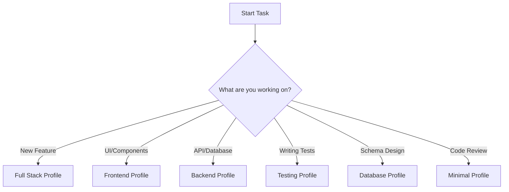

# VS Code Profiles for SubSentinel Project

This project uses multiple VS Code profiles optimized for different development tasks.

## Available Profiles

### 1. **Full Stack (Default)** 
All extensions enabled - best for full project development.

**Extensions:**
- ESLint, Prettier (code quality)
- GitHub Copilot (AI assistance)
- TypeScript, Tailwind CSS (frontend)
- Prisma (database)
- Jest, Playwright (testing)
- GitLens (version control)

**Use when:** Working on features that span frontend, backend, and database.

---

### 2. **Frontend Focus**
Optimized for React/Next.js/TypeScript development.

**Extensions:**
- ESLint, Prettier
- GitHub Copilot
- TypeScript Next
- Auto Rename Tag
- Tailwind CSS IntelliSense
- Error Lens

**Use when:** Building UI components, styling, client-side logic.

---

### 3. **Backend Focus**
Optimized for API routes, server actions, and database work.

**Extensions:**
- ESLint, Prettier
- GitHub Copilot
- TypeScript Next
- Prisma
- Error Lens

**Use when:** Working on API routes, server actions, Prisma schema/migrations.

---

### 4. **Testing Focus**
Optimized for writing and debugging tests.

**Extensions:**
- ESLint, Prettier
- GitHub Copilot
- Jest
- Playwright
- Error Lens

**Use when:** Writing unit tests (Jest) or E2E tests (Playwright).

---

### 5. **Database Focus**
Optimized for database schema design and Prisma work.

**Extensions:**
- Prisma
- Prisma Insider (preview features)
- GitHub Copilot

**Use when:** Designing database schema, writing migrations, optimizing queries.

---

### 6. **Minimal (Performance)**
Bare minimum extensions for fast startup and low resource usage.

**Extensions:**
- ESLint
- Prettier
- TypeScript Next

**Use when:** Working on slow machines or reviewing code.

---

## How to Use Profiles

### Option A: VS Code Built-in Profiles (Recommended)

1. **Create Profile:**
   - Press `Ctrl+Shift+P` (Windows/Linux) or `Cmd+Shift+P` (Mac)
   - Type "Profiles: Create Profile"
   - Choose "Create from Current Profile"
   - Name it (e.g., "Frontend Focus")

2. **Configure Extensions:**
   - Go to Extensions view (`Ctrl+Shift+X`)
   - For each extension:
     - Right-click → "Enable (Workspace)" or "Disable (Workspace)"
   - Save profile settings

3. **Switch Profiles:**
   - Click profile icon in bottom-left corner
   - Select desired profile

### Option B: Manual Profile Files

Create JSON files in `.vscode/profiles/`:

```json
// .vscode/profiles/frontend.json
{
  "extensions": [
    "dbaeumer.vscode-eslint",
    "esbenp.prettier-vscode",
    "github.copilot",
    "ms-vscode.vscode-typescript-next",
    "bradlc.vscode-tailwindcss",
    "formulahendry.auto-rename-tag"
  ]
}
```

## Profile Comparison Table

| Feature | Full Stack | Frontend | Backend | Testing | Database | Minimal |
|---------|-----------|----------|---------|---------|----------|---------|
| ESLint | ✅ | ✅ | ✅ | ✅ | ❌ | ✅ |
| Prettier | ✅ | ✅ | ✅ | ✅ | ❌ | ✅ |
| Copilot | ✅ | ✅ | ✅ | ✅ | ✅ | ❌ |
| TypeScript | ✅ | ✅ | ✅ | ❌ | ❌ | ✅ |
| Tailwind | ✅ | ✅ | ❌ | ❌ | ❌ | ❌ |
| Prisma | ✅ | ❌ | ✅ | ❌ | ✅ | ❌ |
| Jest | ✅ | ❌ | ❌ | ✅ | ❌ | ❌ |
| Playwright | ✅ | ❌ | ❌ | ✅ | ❌ | ❌ |
| GitLens | ✅ | ❌ | ❌ | ❌ | ❌ | ❌ |

## Recommended Workflow



## Performance Tips

1. **Use Frontend/Backend profiles** instead of Full Stack when possible
2. **Disable unused extensions** per profile to reduce memory usage
3. **Use Minimal profile** for code reviews or documentation work
4. **Reload window** after switching profiles for best performance

## Custom Profile Creation

To create a custom profile:

1. Start with closest existing profile
2. Add/remove extensions based on your workflow
3. Save settings with profile
4. Share profile JSON with team if useful

## Profile Settings Location

- **Windows**: `%APPDATA%\Code\User\profiles\`
- **macOS**: `~/Library/Application Support/Code/User/profiles/`
- **Linux**: `~/.config/Code/User/profiles/`

## Team Collaboration

Share profiles with team via:
```bash
# Export profile
code --export-profile "Frontend Focus" --output frontend.code-profile

# Import profile
code --install-profile frontend.code-profile
```

---

**Last Updated:** November 3, 2025
