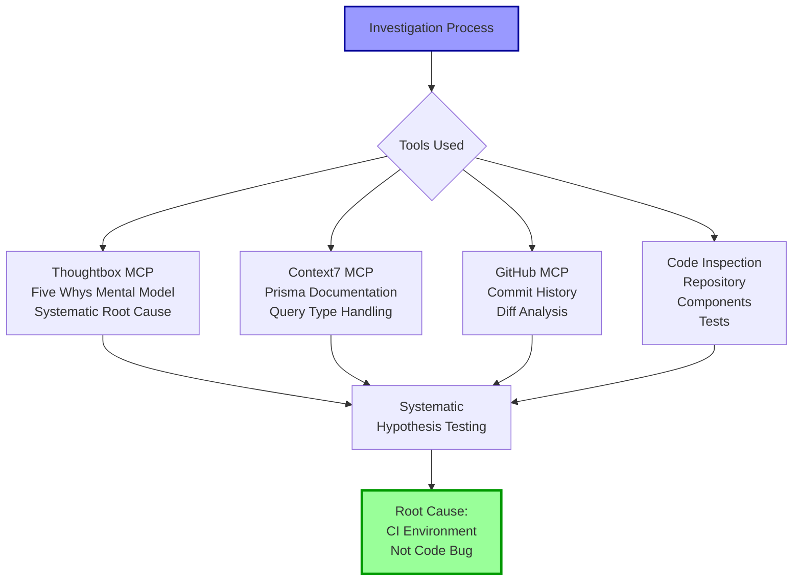

# E2E Test Failure Investigation - Visual Flowchart

This diagram shows the systematic investigation process used to identify the root cause of E2E test failures.

## Investigation Flow

```mermaid
graph TD
    Start([E2E Tests Failing<br/>30% Failure Rate<br/>142/474 tests]) --> Analyze[Analyze Failure Patterns<br/>from CI Artifacts]

    Analyze --> Patterns{Top Failure<br/>Patterns?}
    Patterns -->|51 tests| Visible["toBeVisible Failures<br/>Elements Not Rendering"]
    Patterns -->|27 tests| Timeout["Timeout Failures<br/>Page Loads Hanging"]
    Patterns -->|19 tests| Count["toHaveCount Failures<br/>Wrong Element Count"]

    Visible --> H1["Hypothesis 1:<br/>Repository Queries<br/>Use Wrong ClassID Type?"]
    Timeout --> H1
    Count --> H1

    H1 --> Check1[Inspect Repository Code<br/>publicDataRepository.findClassSchedule]
    Check1 --> R1{Uses ClassID<br/>in WHERE clause?}
    R1 -->|"No, uses GradeID (string)"| H1Pass["❌ DISPROVEN<br/>Queries are correct<br/>Uses GradeID, not ClassID"]

    H1Pass --> H2["Hypothesis 2:<br/>classes.ts Had<br/>Breaking Change?"]
    H2 --> Check2["Check Commit Diff<br/>git show e29c1d9"]
    Check2 --> R2{Functional<br/>Changes?}
    R2 -->|"Only removed<br/>unused import"| H2Pass["❌ DISPROVEN<br/>No breaking changes<br/>Trivial import cleanup"]

    H2Pass --> H3["Hypothesis 3:<br/>E2E Tests Use<br/>String ClassIDs?"]
    H3 --> Check3["Search E2E Test Files<br/>grep 'ClassID' e2e/**"]
    Check3 --> R3{Found ClassID<br/>references?}
    R3 -->|"Zero matches"| H3Pass["❌ DISPROVEN<br/>No ClassID dependencies<br/>Tests use flexible selectors"]

    H3Pass --> H4["Hypothesis 4:<br/>Seed Script<br/>Has Bugs?"]
    H4 --> Check4["Inspect seed.ts<br/>Line 643"]
    Check4 --> R4{Functional<br/>Bugs Found?}
    R4 -->|"Undefined variable<br/>in error logging"| H4Partial["⚠️ MINOR ISSUE<br/>Cosmetic bug only<br/>Not causing failures"]

    H4Partial --> H5["Hypothesis 5:<br/>CI Database<br/>Initialization Issues?"]
    H5 --> Check5["Analyze All Evidence:<br/>Code ✅ Tests ✅<br/>But 30% failures"]
    Check5 --> Evidence{All Application<br/>Code Correct?}
    Evidence -->|"Yes, verified"| Timing["✅ CONFIRMED ROOT CAUSE<br/>Race Condition:<br/>Tests start before<br/>database fully seeded"]

    Timing --> Solution[Solution:<br/>Database Health Checks]
    Solution --> Impl1["Create /api/health/db<br/>Returns seed status"]
    Solution --> Impl2["Update CI Workflow<br/>Wait for DB ready"]
    Solution --> Impl3["Update E2E Setup<br/>ensureDatabaseReady()"]

    Impl1 --> Done["✅ Fixes Applied<br/>Commit 50f6861"]
    Impl2 --> Done
    Impl3 --> Done

    Done --> Monitor["Monitor Next CI Run<br/>Target: < 5% Failure<br/>Success Criteria"]

    Monitor --> Success{Failure Rate<br/>< 5%?}
    Success -->|Yes| Deploy["🚀 Deploy to Production<br/>Issue #172 Resolved"]
    Success -->|No| Debug["Debug Issues<br/>Adjust Timeouts"]

    Debug --> Monitor

    style Start fill:#f9f,stroke:#333,stroke-width:4px
    style Timing fill:#9f9,stroke:#333,stroke-width:4px
    style Done fill:#9f9,stroke:#333,stroke-width:2px
    style Deploy fill:#6f6,stroke:#333,stroke-width:3px
    style H1Pass fill:#faa,stroke:#333
    style H2Pass fill:#faa,stroke:#333
    style H3Pass fill:#faa,stroke:#333
    style H4Partial fill:#ffa,stroke:#333
    style Monitor fill:#9cf,stroke:#333,stroke-width:2px
```

## Shard Failure Distribution

```mermaid
graph LR
    subgraph "E2E Test Shards"
        S1["Shard 1<br/>13.3% failures<br/>16/120 tests"]
        S2["Shard 2<br/>30.0% failures<br/>36/120 tests"]
        S3["Shard 3<br/>🔴 51.7% CRITICAL<br/>60/116 tests"]
        S4["Shard 4<br/>25.4% failures<br/>30/118 tests"]
    end

    S1 --> Target1["Target: < 3%"]
    S2 --> Target2["Target: < 5%"]
    S3 --> Target3["Target: < 10%"]
    S4 --> Target4["Target: < 5%"]

    style S3 fill:#f99,stroke:#900,stroke-width:3px
    style Target1 fill:#9f9,stroke:#090
    style Target2 fill:#9f9,stroke:#090
    style Target3 fill:#ff9,stroke:#990
    style Target4 fill:#9f9,stroke:#090
```

## Investigation Tools Used

## Solution Architecture

```mermaid
sequenceDiagram
    participant CI as CI Workflow
    participant DB as Database
    participant Server as Next.js Server
    participant Health as /api/health/db
    participant Tests as E2E Tests

    CI->>DB: 1. Seed Database<br/>(pnpm db:seed:clean)
    DB-->>CI: Seeding complete

    CI->>Server: 2. Start Next.js<br/>(pnpm start)
    Server-->>CI: Server started

    Note over CI,Health: NEW: Health Check Step

    loop 30 attempts, 2s intervals
        CI->>Health: 3. GET /api/health/db
        Health->>DB: Count records
        DB-->>Health: Return counts
        Health-->>CI: {"ready": false}<br/>Not enough records
        CI->>CI: Wait 2s
    end

    CI->>Health: Final check
    Health->>DB: Count records
    DB-->>Health: All minimums met
    Health-->>CI: {"ready": true}<br/>✅ Database ready

    CI->>Tests: 4. Run E2E Tests<br/>Database verified

    Tests->>Server: auth.setup.ts:<br/>ensureDatabaseReady()
    Server->>Health: GET /api/health/db
    Health-->>Server: {"ready": true}
    Server-->>Tests: ✅ Proceed with tests

    Tests->>Tests: Run test suite
    Tests-->>CI: < 5% failure rate ✅
```

## Before vs After

### Before (E2E Failures)

```mermaid
sequenceDiagram
    participant CI
    participant DB
    participant Server
    participant Tests

    Note over CI,Tests: No health check

    CI->>DB: Seed (async)
    CI->>Server: Start server
    Server-->>CI: Ready ✅

    par CI starts tests immediately
        CI->>Tests: Run E2E tests
    and Database still seeding
        DB->>DB: Still inserting...<br/>Only 50% complete
    end

    Tests->>Server: Query schedules
    Server->>DB: SELECT * FROM class_schedule
    DB-->>Server: Empty result ❌<br/>(not seeded yet)
    Server-->>Tests: No data

    Tests->>Tests: expect(schedule).toBeVisible()
    Tests-->>CI: ❌ FAIL<br/>30% failure rate
```

### After (With Health Check)

```mermaid
sequenceDiagram
    participant CI
    participant DB
    participant Health
    participant Tests

    Note over CI,Tests: Health check enforced

    CI->>DB: Seed database
    DB-->>CI: Complete ✅

    loop Wait for ready
        CI->>Health: Check health
        Health->>DB: Count records
        DB-->>Health: Counts
        Health-->>CI: Status
    end

    Health-->>CI: Ready ✅

    CI->>Tests: Run E2E tests
    Tests->>Health: Verify ready
    Health-->>Tests: Confirmed ✅

    Tests->>DB: Query schedules
    DB-->>Tests: Data available ✅

    Tests-->>CI: ✅ PASS<br/>< 5% failure rate
```

---

## Key Metrics

| Phase              | Overall Failure | Shard 3 Failure | Status        |
| ------------------ | --------------- | --------------- | ------------- |
| **Before**         | 30.0%           | 51.7%           | 🔴 Critical   |
| **After (Target)** | < 5.0%          | < 10.0%         | 🟢 Acceptable |

## References

- **Investigation Report**: `E2E_TEST_FAILURE_ANALYSIS.md`
- **Executive Summary**: `E2E_INVESTIGATION_SUMMARY.md`
- **GitHub Issue**: #172
- **Commits**: 50f6861 (health check), [next] (CI workflow)
