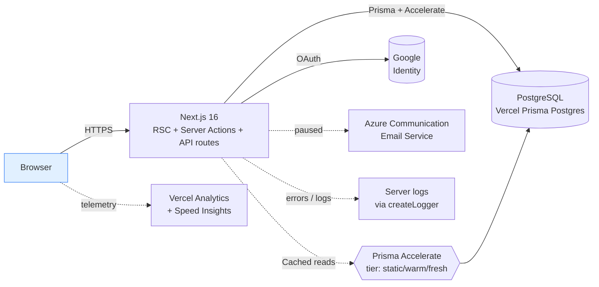
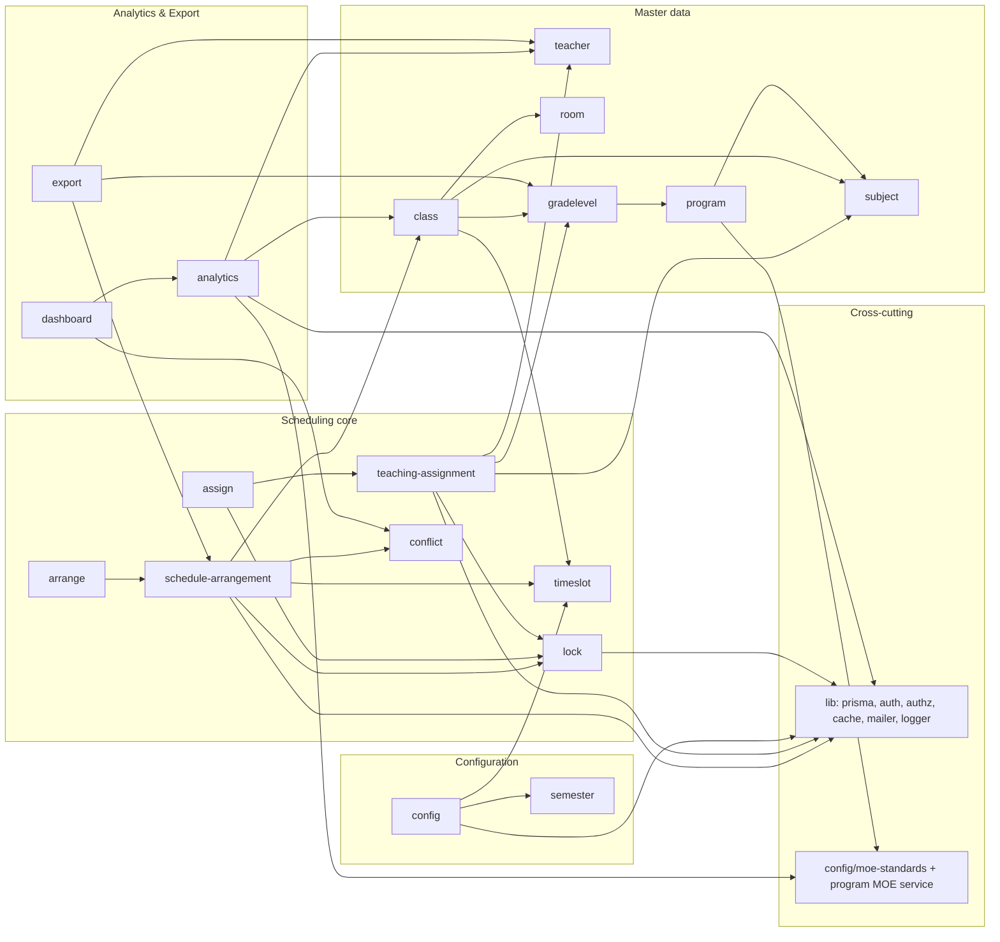
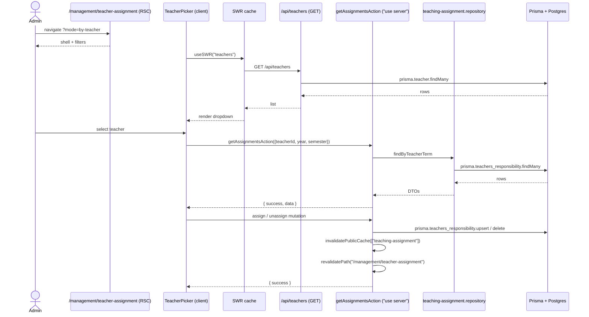
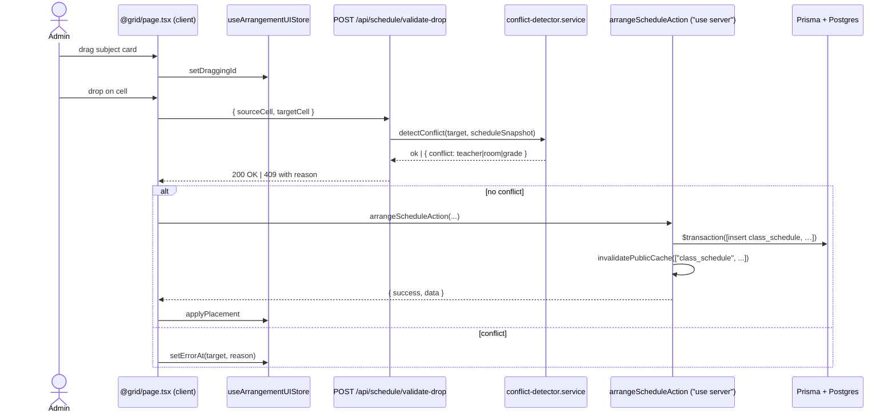
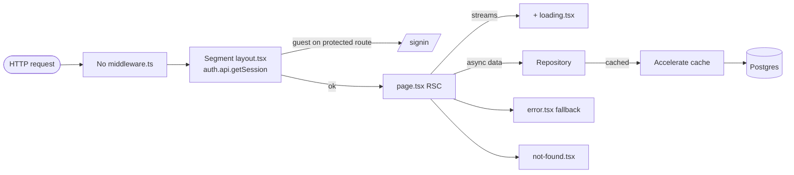

# Architecture — Phrasongsa Timetable

> Generated by `/investigate` on 2026-05-26. Snapshot of `main` at commit `c6da6f70`.
> Companion docs: [`CODE_REVIEW.md`](./CODE_REVIEW.md), [`REFACTOR_PLAN.md`](./REFACTOR_PLAN.md), [`FEATURE_MAP.md`](./FEATURE_MAP.md).

## 1. Overview

Phrasongsa Timetable is a Thai-language school timetable platform for secondary schools (Mathayom M.1–M.6) with MOE (Ministry of Education) compliance baked in. Admins configure semesters, assign teachers to subjects, arrange schedules via drag-and-drop with conflict detection, and publish timetables that public viewers can browse without authentication. Built with **Next.js 16 App Router** on React 19, deployed on **Vercel** (no Dockerfile present).

### Stack

| Concern             | Choice                                                                 |
|---------------------|------------------------------------------------------------------------|
| Framework           | Next.js **16.2.6**, App Router                                         |
| UI runtime          | React **19.2.3** + React Compiler (`reactCompiler: true`)             |
| Language            | TypeScript 5.9 strict mode (with `noUnusedLocals/Parameters` deferred) |
| Package manager     | pnpm 10.33.2                                                           |
| ORM                 | Prisma **7.6** with `@prisma/adapter-pg` + Accelerate extension        |
| Database            | PostgreSQL (Vercel Prisma Postgres in prod; Docker for E2E)            |
| Auth                | **better-auth 1.6** (migrated from NextAuth v5) + Google OAuth         |
| Validation          | **Valibot 1.3** (not Zod) — per-feature schemas                       |
| Client state        | **Zustand 5** + Immer                                                  |
| Client data fetch   | **SWR 2** + axios                                                      |
| UI library          | **MUI v7** + **Tailwind CSS v4** (PostCSS plugin only, no config)     |
| DnD                 | `@dnd-kit/{core,sortable,utilities}`                                   |
| Notifications       | `notistack`                                                            |
| Charts              | `recharts 3.8`                                                         |
| PDF/Excel export    | `@react-pdf/renderer`, `jspdf`, `html2canvas`, `exceljs`              |
| Email               | `@azure/communication-email` (currently *paused* per CLAUDE.md)        |
| Analytics           | `@vercel/analytics` + `@vercel/speed-insights` (gated on `VERCEL=1`)  |
| Telemetry           | Empty `src/instrumentation.ts` stub — no OTEL/Sentry                  |
| Testing             | Vitest (4 configs) + Playwright (4 configs)                            |
| Linting / format    | ESLint v9 flat config + Prettier 3.8                                  |

### Deployment

- **Target**: Vercel. No `Dockerfile`. `vercel.json` not present at root (Vercel-default).
- **CI**: `.github/workflows/{ci.yml,e2e-tests.yml,e2e-post-run.yml}`.
- **Build-time toggles**: `NEXT_DIST_DIR` allows parallel dev servers; `NEXT_TELEMETRY_DISABLED=1` honored.
- **Cache Components**: `cacheComponents: false` in `next.config.mjs:7` — intentionally paused while React Compiler cache behavior is monitored.

### Security headers (`next.config.mjs:22-66`)

- `X-Frame-Options: DENY`
- `Strict-Transport-Security: max-age=63072000; includeSubDomains; preload`
- `Content-Security-Policy` with `script-src 'self' 'unsafe-inline' 'unsafe-eval'` — `'unsafe-eval'` required by React Compiler + MUI Emotion SSR (documented inline). `connect-src` allow-lists `vitals.vercel-insights.com` for Speed Insights.
- `Permissions-Policy: camera=(), microphone=(), geolocation=()`
- `frame-ancestors 'none'`

---

## 2. Module groupings (feature-by-domain)

The codebase already follows clean DDD per-feature layering under `src/features/*`:

```
src/features/<feature>/
├── application/
│   ├── actions/        ← "use server" entry points (revalidate + invalidate cache)
│   └── schemas/        ← Valibot input schemas
├── domain/
│   ├── services/       ← Pure business logic, no I/O
│   ├── types/          ← Shared types
│   └── utils/          ← Pure helpers
├── infrastructure/
│   └── repositories/   ← Prisma access
└── presentation/
    ├── components/     ← React components (mix of "use client" and RSC)
    ├── hooks/          ← Client hooks (SWR wrappers, etc.)
    └── stores/         ← Zustand stores
```

Approximately 20 feature folders. Domain groupings:

### Scheduling core
- **`schedule-arrangement`** — DnD-based grid arrangement, conflict detection, auto-arrange solver
- **`lock`** — Pin classes to specific timeslots; preserved during auto-arrange
- **`assign`** — Teacher-to-subject assignment (legacy entry point under `/schedule/*/assign`)
- **`teaching-assignment`** — Refactored assignment hub at `/management/teacher-assignment` with `by-grade` / `by-teacher` modes (active in recent commits)
- **`arrange`** — Lower-level arrangement actions
- **`conflict`** — Conflict detection / resolution actions
- **`timeslot`** — Generate / inspect timeslots per term

### Configuration
- **`config`** — Per-semester `table_config` (JSON Config field, completion %, publish status)
- **`semester`** — Semester lifecycle (DRAFT → PUBLISHED → LOCKED → ARCHIVED)

### Master data
- **`teacher`**, **`subject`**, **`room`**, **`gradelevel`**, **`program`**, **`class`** — CRUD for entities the schedule references.

### Analytics & export
- **`analytics`** — Coverage, time distribution, MOE compliance reports
- **`dashboard`** — Aggregated stat cards, charts, readiness checks
- **`export`** — PDF / Excel exports for student and teacher timetables

### Communication
- **`email`** — `email-outbox` table + outbox UI. Wired through `auth.ts` for password-reset and email-verify flows. Currently **paused** per CLAUDE.md (`Email disabled: skip src/lib/mailer.ts until mail service chosen`).

### Cross-cutting (lives in `src/lib/`, not `src/features/`)

| File                                            | Purpose                                              |
|-------------------------------------------------|------------------------------------------------------|
| `src/lib/prisma.ts:1-87`                        | PrismaClient singleton; Accelerate-first w/ pg fallback |
| `src/lib/auth.ts:15-318`                        | better-auth config; OAuth, scrypt, admin plugin      |
| `src/lib/auth-client.ts`                        | Client-side auth hooks (createAuthClient)            |
| `src/lib/authz.ts:1-24`                         | `normalizeAppRole` / `isAdminRole` / `isGuestRole` |
| `src/lib/cache-config.ts:1-58`                  | 3 cache tiers (static 600s / warm 120s / fresh 60s) |
| `src/lib/cache-invalidation.ts:1-31`            | `invalidatePublicCache(tags)`                       |
| `src/lib/mailer.ts`                             | Azure Communication Services wrapper                |
| `src/lib/logger.ts`                             | Structured logger (dev/prod aware)                  |
| `src/lib/prisma-transaction.ts`                 | `withPrismaTransaction<T>` helper                   |
| `src/lib/thai-year-format.ts`                   | BE ↔ CE year conversion                              |
| `src/lib/timetable-config*.ts`                  | Shared schedule constants                            |
| `src/lib/public/{teachers,classes,stats}.ts`    | Read-only public data layer (cached via Accelerate)  |
| `src/lib/infrastructure/repositories/public-data.repository.ts` | Shared public read repo               |

### MOE compliance (cross-feature)

- `src/config/moe-standards.ts` — Weekly lesson standards per year (M.1–M.6) per learning area (8 areas).
- `src/features/program/domain/services/moe-validation.service.ts` — `validateMandatorySubjects()`, `validateProgramMOECredits()`, `generateMOEComplianceReport()`.
- `src/features/class/domain/services/class-validation.service.ts` — Per-class schedule rules.
- `ConfigID` format `[1-3]-\d{4}` validated in `config-validation.service.ts:58-72`.
- `TimeslotID` generated on timeslot creation and used as FK in `class_schedule`.

---

## 3. Cross-cutting concerns

- **Auth gating**: No `middleware.ts`. Protected segments rely on per-layout session checks. Each protected segment (`/dashboard`, `/schedule`, `/management`) has its own `layout.tsx` that runs `auth.api.getSession()` and redirects to `/signin` on missing/invalid session. See `CODE_REVIEW.md` finding **H-2** for risk.
- **Authorization**: Role check is `isAdminRole(normalizeAppRole(session.user.role))`. Centralized in `src/lib/authz.ts`. Only `admin` is privileged; `teacher` / `student` are guest equivalents.
- **Caching**: Prisma Accelerate when `ACCELERATE_URL` or `PRISMA_DATABASE_URL` is present. Tag-based invalidation via `invalidatePublicCache([tag, …])`. `cacheStrategy("warm", ["teachers"])` spread into Prisma reads. **Falls back to no-op when Accelerate is not active** — local dev / E2E.
- **Revalidation**: Server Actions call `revalidatePath("/dashboard/[...]")` and `revalidateTag(...)` after mutations. Coverage incomplete — see CODE_REVIEW finding **M-5**.
- **Error boundaries**: `ErrorBoundary` in root layout, `RouteErrorFallback` per segment, 13 `error.tsx` files.
- **Loading UX**: 23 `loading.tsx` files; 59 `<Suspense>` boundaries across the app. Dashboard root uses 7 Suspense boundaries for parallel streaming.
- **Observability**: `instrumentation.ts` is an empty stub. No Sentry, OTEL, custom logger persistence. `console.warn` / `console.error` lint-allowed.
- **i18n**: Thai strings hardcoded throughout. No `next-intl` / `react-i18next`. Sarabun font loaded via `next/font/google` in `src/app/layout.tsx:14-18`. Thai Buddhist year formatting via `lib/thai-year-format.ts`.

---

## 4. Diagrams

### 4.1 System diagram



### 4.2 Route tree (App Router)

```mermaid
flowchart TD
  root["/ (root layout)"] --> public["(public) layout"]
  root --> signin["/signin"]
  root --> forgot["/forgot-password (redirect)"]
  root --> reset["/reset-password"]
  root --> dashboard["/dashboard layout (auth gate)"]
  root --> schedule["/schedule layout (auth gate)"]
  root --> mgmt["/management layout (auth gate)"]
  root --> api["/api/*"]

  public --> home["/"]
  public --> teacher_pub["/teachers/[id]/[year]/[sem]"]
  public --> class_pub["/classes/[gradeId]/[year]/[sem]"]
  public --> about["/about, /contact, /privacy-policy"]

  dashboard --> dash_home["/dashboard"]
  dashboard --> dash_profile["/dashboard/profile"]
  dashboard --> dash_term["[year]/[sem]"]
  dash_term --> analytics_p["/analytics"]
  dash_term --> all_ts["/all-timeslot"]
  dash_term --> all_prog["/all-program"]
  dash_term --> stu_t["/student-table"]
  dash_term --> tch_t["/teacher-table"]
  dash_term --> confl["/conflicts"]

  schedule --> sel["/select-semester (redirect)"]
  schedule --> sched_term["[year]/[sem]"]
  sched_term --> sched_assign["/assign"]
  sched_term --> sched_arrange["/arrange (parallel: @header @palette @grid @inspector @modal)"]
  sched_term --> sched_lock["/lock"]
  sched_term --> sched_config["/config (redirect)"]
  sched_arrange --> intercept["@modal/(.)room-select intercepts /room-select"]

  mgmt --> mgmt_home["/management"]
  mgmt --> mgmt_teacher["/teacher"]
  mgmt --> mgmt_subj["/subject"]
  mgmt --> mgmt_rooms["/rooms"]
  mgmt --> mgmt_prog["/program/[programId], /program/year/[year]"]
  mgmt --> mgmt_grade["/gradelevel"]
  mgmt --> mgmt_email["/email-outbox (redirect — paused)"]
  mgmt --> mgmt_ta["/teacher-assignment"]

  api --> api_auth["/auth/[...all] (better-auth)"]
  api --> api_data["/teachers, /gradelevels, /timeslots, /rooms/available"]
  api --> api_sched["/schedule/{teacher,auto-arrange,validate-drop}"]
  api --> api_export["/export/{student,teacher}-timetable/pdf"]
  api --> api_admin["/admin/seed-semesters"]
  api --> api_cron["/cron/email-outbox-cleanup"]
  api --> api_health["/ping, /health/db, /telemetry/loading-stuck"]
```



### 4.3 Module dependency graph



No import cycles surfaced during the deep pass. Domain services do not import repositories; presentation never imports infrastructure directly — it goes through actions.

### 4.4 ER diagram (from `prisma/schema.prisma`)

```mermaid
erDiagram
  class_schedule ||--|| timeslot : "TimeslotID"
  class_schedule ||--|| gradelevel : "GradeID"
  class_schedule }o--o| room : "RoomID"
  class_schedule ||--|| subject : "SubjectCode"
  class_schedule }o--o{ teachers_responsibility : "M:N"
  gradelevel }o--o| program : "ProgramID"
  program ||--o{ program_subject : "ProgramID"
  subject ||--o{ program_subject : "SubjectCode"
  teachers_responsibility ||--|| teacher : "TeacherID"
  teachers_responsibility ||--|| gradelevel : "GradeID"
  teachers_responsibility ||--|| subject : "SubjectCode"
  break_group ||--|| table_config : "ConfigID"
  break_group ||--o{ break_group_grade : "BreakGroupID"
  gradelevel ||--o{ break_group_grade : "GradeID"
  User ||--o{ Account : "userId"
  User ||--o{ Session : "userId"

  class_schedule {
    int ClassID PK
    string TimeslotID FK
    string SubjectCode FK
    int RoomID FK_nullable
    string GradeID FK
    bool IsLocked
  }
  timeslot {
    string TimeslotID PK
    int AcademicYear
    enum Semester
    Time StartTime
    Time EndTime
    enum Breaktime
    enum DayOfWeek
  }
  gradelevel {
    string GradeID PK
    int Year
    int Number
    int StudentCount
    int ProgramID FK_nullable
  }
  table_config {
    string ConfigID PK
    int AcademicYear
    enum Semester
    json Config
    enum status
    int configCompleteness
  }
  teachers_responsibility {
    int RespID PK
    int TeacherID FK
    string GradeID FK
    string SubjectCode FK
    int AcademicYear
    enum Semester
    int TeachHour
  }
```

> **Drift note**: `EmailOutbox` and `Verification` models are referenced by `prisma/migrations/*` and `prisma/generated/models/*` but **absent from `schema.prisma`**. See CODE_REVIEW finding **C-1**.

### 4.5 Sequence — Teaching assignment (by-teacher mode)



### 4.6 Sequence — Schedule arrangement DnD drop



### 4.7 Request lifecycle



---

## 5. Anti-patterns and notable gaps (deep-pass summary)

Surfaced during this investigation; details in `CODE_REVIEW.md`.

- **Schema drift** between `schema.prisma` and `prisma/generated/`+migrations (`EmailOutbox`, `Verification`).
- **No `import "server-only"` markers** anywhere in the codebase. Server modules safe only by folder convention.
- **No `middleware.ts`** — protected routes rely on per-layout gates.
- **Four oversized `"use client"` pages** consuming most-trafficked authed routes (`dashboard`, `teacher-table`, `student-table`, `assign/teacher_responsibility`).
- **Three data-fetch idioms** coexist: SWR, axios, Server Actions. No documented rule.
- **8 of 16 API routes leak `error.message`** in 500 responses.
- **2 mutating actions in `conflict-resolution.actions.ts` have no auth check**.
- **`updateConfigStatusAction` mutates publish state without admin role check**.
- **92 `as any` / `as unknown as` casts** across 26 files — type-safety budget.
- **Empty `instrumentation.ts`** — no production monitoring path.
- **Mailer wired into `auth.ts`** despite "Email disabled" project policy — silently produces SKIPPED outbox rows in prod.

See `CODE_REVIEW.md` for severity-ranked findings and `REFACTOR_PLAN.md` for sequenced remediation.
