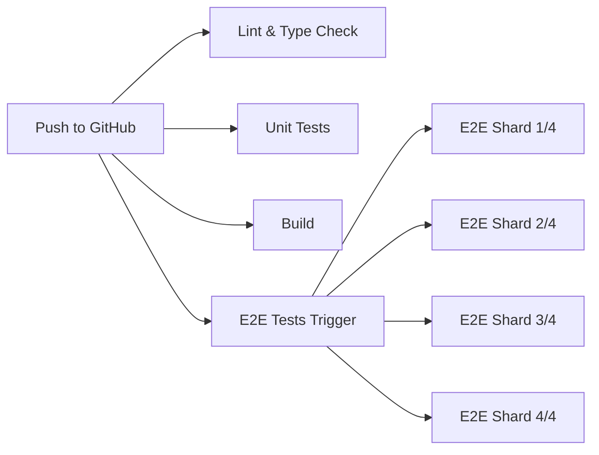

# CI-First Development Workflow

> **Philosophy:** Trust CI, not local validation. Speed over pre-flight checks.

## Overview

This project uses a **CI-first development workflow** where all tests, linting, and type-checking are delegated to GitHub Actions. Local development is optimized for **speed and iteration**, not validation.

## Core Principles

### 1. **Trust CI as the Quality Gatekeeper**

- ✅ All pull requests MUST pass CI before merging
- ✅ Branch protection rules enforce CI checks
- ✅ CI runs full validation suite (lint + type-check + unit tests + build + E2E)
- ❌ No pre-commit hooks that slow down `git commit`
- ❌ No pre-push hooks that block `git push`

### 2. **Local Development = Speed**

- ✅ `pnpm dev` starts instantly (no validation overhead)
- ✅ `git commit` completes in milliseconds (no hooks)
- ✅ `git push` uploads immediately (no blocking checks)
- ℹ️ Optional validation scripts available when needed (`pnpm test:affected`)

### 3. **Continuous Feedback via GitHub**

- 🔄 Push commits frequently to get CI feedback
- 🔄 Small, incremental commits catch issues early
- 🔄 CI runs in parallel (4 shards for E2E, separate jobs for lint/test/build)
- 🔄 Results visible in ~10-15 minutes (lint/unit) or ~15 minutes (E2E)

## Daily Workflow

### Starting Development

```bash
# 1. Pull latest from develop branch
git checkout develop
git pull origin develop

# 2. Create feature branch
git checkout -b feature/add-teacher-export

# 3. Start development server (FAST - no validation)
pnpm dev
```

### Writing Code

```bash
# 4. Make changes to files
# ✅ NO automatic validation on save
# ✅ NO pre-commit hooks blocking you
# ✅ FAST iteration loop

# 5. Commit frequently (no hooks = instant commit)
git add src/features/teacher/export.ts
git commit -m "feat: add teacher export logic"
```

### Getting Feedback

```bash
# 6. Push to GitHub to trigger CI (no pre-push checks)
git push origin feature/add-teacher-export

# 7. Create pull request
# CI automatically runs:
# - Lint & Type Check (~5 min)
# - Unit Tests (~8 min)
# - Build (~8 min)
# - E2E Tests (~15 min, 4 parallel shards)

# 8. Continue working while CI runs
# Make more commits, CI will re-run automatically
```

### Before Merging

```bash
# 9. Wait for all CI checks to pass ✅
# 10. Request code review from team
# 11. Merge via GitHub UI (squash recommended)
```

## Optional Local Validation

While the CI-first workflow **discourages** local validation, these scripts are available for **special cases**:

### Quick Validation Scripts

```bash
# Run affected tests only (faster than full suite)
pnpm test:affected

# Lint specific files (when troubleshooting CI failures)
pnpm lint:files src/features/teacher/*.ts

# Type-check (rare - IDE usually catches these)
pnpm typecheck

# Full test suite (avoid unless necessary - slow)
pnpm test
```

### When to Use Local Validation

**✅ USE when:**
- Debugging a failing CI check (reproduce locally)
- Pre-release validation (major version bump)
- Offline development (no GitHub access)

**❌ DON'T USE when:**
- Normal feature development (trust CI instead)
- Every commit (too slow, defeats the purpose)
- Checking "if it works" (push to CI for that)

## Understanding CI Jobs

### Parallel Execution

Our CI runs **4 parallel jobs** to provide fast feedback:



### Job Durations

| Job              | Duration  | Parallelized | Caching |
|------------------|-----------|--------------|---------|
| Lint & Type Check| ~3-5 min  | No           | Yes ✅  |
| Unit Tests       | ~8-10 min | Yes (50%)    | Yes ✅  |
| Build            | ~8-10 min | No           | Yes ✅  |
| E2E Tests        | ~15 min   | Yes (4x)     | Yes ✅  |

**Total feedback time:** ~15 minutes for complete validation

### CI Optimizations

We use **aggressive caching** to speed up CI:

1. **PNPM Cache** - Cached dependencies (setup-node)
2. **Prisma Client** - Cached generated client (actions/cache)
3. **Next.js Build** - Cached `.next/cache` (actions/cache)
4. **TypeScript Build Info** - Cached `.tsbuildinfo` (actions/cache)
5. **Jest Cache** - Cached test results (actions/cache)

**Result:** ~2-3 minute reduction per job compared to non-cached CI.

## CI Triggers

### Automatic Triggers

CI runs automatically on:

- ✅ Push to `main` or `develop` branches
- ✅ Pull request creation
- ✅ Pull request update (new commits)
- ❌ Skipped for docs-only changes (`**.md`, `docs/**`)

### Manual Triggers

You can manually trigger workflows via GitHub UI:

- **E2E Tests**: Actions → E2E Tests → Run workflow → Choose shard count (1-8)

## Best Practices

### DO ✅

- **Commit frequently** - Small commits catch issues early
- **Push often** - Get CI feedback while working
- **Read CI logs** - Understand failures before retrying
- **Use draft PRs** - For work-in-progress (CI still runs)
- **Trust the system** - CI is comprehensive, no need to double-check locally

### DON'T ❌

- **Don't run full test suite locally** - Slow and redundant
- **Don't add pre-commit hooks** - Defeats the CI-first philosophy
- **Don't wait for "perfect" commits** - CI will catch issues
- **Don't skip CI** - It's your quality gatekeeper
- **Don't merge failing PRs** - Branch protection prevents this anyway

## Troubleshooting

### "CI is taking too long"

**Solutions:**
1. Check if you can work on next task while CI runs (parallel work)
2. Push smaller commits (faster to validate)
3. Use draft PR for WIP (CI still runs, but reviewers know it's not ready)

### "CI failed but it works locally"

**Solutions:**
1. Check [CI Troubleshooting Guide](./CI_TROUBLESHOOTING.md)
2. Verify environment variables (CI uses `DATABASE_URL`, `AUTH_SECRET`, etc.)
3. Check Node version (CI uses Node 20, match it locally)
4. Review CI logs for specific error messages

### "I need faster feedback"

**Solutions:**
1. Use `pnpm test:affected` for quick unit test validation
2. Use TypeScript errors in IDE (instant feedback)
3. Use ESLint extension in VS Code (instant linting)
4. Push to GitHub and continue working (parallel feedback)

## AI Agent Guidance

For AI coding assistants working on this codebase:

1. **Never suggest adding pre-commit hooks** - Violates CI-first philosophy
2. **Recommend pushing to CI** - Instead of "run tests locally"
3. **Use optional validation scripts sparingly** - Only when debugging CI failures
4. **Focus on code quality, not validation** - Trust CI to catch issues
5. **Suggest small, frequent commits** - Better for CI feedback loop

## Migration Notes

This project **transitioned to CI-first** from traditional pre-commit validation:

- **Before:** Pre-commit hooks ran lint/typecheck/tests (slow `git commit`)
- **After:** No hooks, instant commits, CI validates everything
- **Result:** 10x faster local development, same quality guarantees

## Related Documentation

- [CI Troubleshooting Guide](./CI_TROUBLESHOOTING.md) - Debugging CI failures
- [E2E Reliability Guide](./E2E_RELIABILITY_GUIDE.md) - E2E testing best practices
- [AGENTS.md](../AGENTS.md) - AI agent development guidelines

## Summary

**CI-first development** means:

- 🚀 **Fast local development** - No validation overhead
- 🤖 **CI as quality gatekeeper** - Comprehensive automated checks
- 🔄 **Continuous feedback** - Push often, iterate quickly
- ✅ **Branch protection** - Can't merge without passing CI
- 📊 **Transparency** - All validation happens in public (GitHub Actions)

**Remember:** Trust the system. CI is fast, comprehensive, and reliable. Local validation is optional and should be used sparingly.
