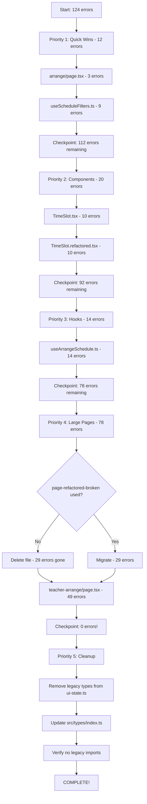

# Phase 3: Full Codebase Type Migration Plan

**Status:** In Progress (18/142 errors fixed)  
**Started:** 2025-10-30  
**Current State:** 142 → 124 errors remaining

---

## Executive Summary

### What Was Completed (Phase 2)
- ✅ Created strict type system in `schedule.types.ts` (camelCase)
- ✅ Built type transformers with 28 passing tests
- ✅ Extracted `useTeacherSchedule` hook (368 lines, 0 errors)
- ✅ Extracted `LockedScheduleList` component (186 lines, 0 errors)
- ✅ Total: 774 lines of strictly-typed production-ready code

### What Was Fixed (Phase 3 - Session 1)
- ✅ **DraggableSubjectCard.tsx** (1 error → 0)
- ✅ **useConflictValidation.ts** (2 errors → 0)
- ✅ **dashboard-stats.service.ts** (2 errors → 0)
- ✅ **dashboard.repository.ts** (13 errors → 0)
- **Total:** 18 errors fixed, 124 remaining

---

## The Core Problem

**ROOT CAUSE:** Two conflicting `SubjectData` type definitions coexist:

### Legacy Types (ui-state.ts) - PascalCase
```typescript
export interface SubjectData {
  SubjectCode: string;
  SubjectName: string;
  GradeID: string;
  TeacherID: number;
  RoomID?: number;
  // ... PascalCase fields
}
```

### Strict Types (schedule.types.ts) - camelCase
```typescript
export interface SubjectData {
  itemID: number;
  subjectCode: string;
  subjectName: string;
  gradeID: string;
  teacherID: number;
  category: SubjectCategory;
  credit: number;
  teachHour: number;
  roomID?: number;
  // ... camelCase fields with more complete typing
}
```

**Impact:**
- `@/types` (index.ts) re-exports the OLD PascalCase types from `ui-state.ts`
- `arrangement-ui.store.ts` uses the NEW camelCase types from `schedule.types.ts`
- Components importing from `@/types` get PascalCase, but store expects camelCase
- Result: Type conflicts throughout the codebase

---

## Remaining Work - 124 Errors Across 7 Files

### Priority 1: Quick Wins (12 errors) - 15 minutes
**Why first:** Isolated, simple fixes that build momentum

#### 1.1 arrange/page.tsx (3 errors)
**File:** `src/app/schedule/[semesterAndyear]/arrange/page.tsx`

**Errors:**
- Line 361: `TeacherData` type mismatch (PascalCase vs camelCase)
- Line 962: `TeacherData` missing properties
- Line 1009: Invalid type conversion

**Fix Strategy:**
```typescript
// Change imports from:
import type { TeacherData } from '@/types';

// To:
import type { TeacherData } from '@/types/schedule.types';
```

**Estimated Time:** 5 minutes

#### 1.2 useScheduleFilters.ts (9 errors)
**File:** `src/features/schedule-arrangement/presentation/hooks/useScheduleFilters.ts`

**Common Pattern:** Import from `@/types` → Import from `@/types/schedule.types`

**Estimated Time:** 10 minutes

---

### Priority 2: Components (20 errors) - 30 minutes

#### 2.1 TimeSlot.tsx (10 errors)
**File:** `src/app/schedule/[semesterAndyear]/arrange/component/TimeSlot.tsx`

**Strategy:**
1. Update imports to use `schedule.types.ts`
2. Fix PascalCase → camelCase field access
3. Verify drag/drop still works with new types

**Estimated Time:** 15 minutes

#### 2.2 TimeSlot.refactored.tsx (10 errors)
**File:** `src/app/schedule/[semesterAndyear]/arrange/component/TimeSlot.refactored.tsx`

**Note:** This is a refactored version. Check if it's actually used. If not, consider deleting.

**Strategy:** Same as TimeSlot.tsx

**Estimated Time:** 15 minutes

---

### Priority 3: Hooks (14 errors) - 20 minutes

#### 3.1 useArrangeSchedule.ts (14 errors)
**File:** `src/features/schedule-arrangement/presentation/hooks/useArrangeSchedule.ts`

**This is a critical hook!** Used throughout arrangement pages.

**Common Issues:**
- Imports from `@/types` instead of `@/types/schedule.types`
- SWR type signatures using old `SubjectData`
- Server Action responses typed with PascalCase

**Strategy:**
1. Change all imports to `schedule.types.ts`
2. Update SWR hooks: `useSWR<OldType>` → `useSWR<NewType>`
3. Add type guards for Server Action responses (like Phase 2)

**Estimated Time:** 20 minutes

---

### Priority 4: Large Page Components (78 errors) - 2-3 hours

#### 4.1 teacher-arrange/page.tsx (49 errors)
**File:** `src/app/schedule/[semesterAndyear]/arrange/teacher-arrange/page.tsx`

**This is the BIG ONE!** Main teacher arrangement page.

**Error Categories:**
1. **Type Import Conflicts** (~15 errors)
   - `SubjectData` from `@/types` vs `schedule.types`
   - `TeacherData`, `TimeslotData` conflicts

2. **Store Integration** (~20 errors)
   - Store expects camelCase, page passes PascalCase
   - `setSelectedSubject`, `setDraggedSubject`, etc.

3. **Zustand Store Access** (~10 errors)
   - Property name mismatches (e.g., `isCilckToChangeSubject` typo)
   - Type mismatches in store selectors

4. **Data Transformations** (~4 errors)
   - `GradeID` → `gradeID` throughout

**Strategy (Multi-Step):**

**Step 1:** Fix imports (5 min)
```typescript
// Replace at top of file:
import type {
  SubjectData,
  TeacherData,
  TimeslotData,
  DayOfWeekDisplay,
  BreakSlotData,
} from '@/types/schedule.types'; // Changed from '@/types'
```

**Step 2:** Fix store interactions (30 min)
- Find all `setSelectedSubject`, `setDraggedSubject`, `setTeacherData` calls
- Ensure data passed matches camelCase `SubjectData` interface
- Use type transformers if legacy data needs conversion

**Step 3:** Fix field access (15 min)
```typescript
// Change throughout file:
subject.GradeID → subject.gradeID
subject.SubjectCode → subject.subjectCode
teacher.TeacherID → teacher.teacherID
```

**Step 4:** Fix type assertions (10 min)
- Remove incorrect type casts
- Add proper type guards where needed

**Step 5:** Test thoroughly (30 min)
- Verify drag/drop still works
- Test subject selection
- Test timeslot operations

**Estimated Time:** 1.5-2 hours

#### 4.2 page-refactored-broken.tsx (29 errors)
**File:** `src/app/schedule/[semesterAndyear]/arrange/teacher-arrange/page-refactored-broken.tsx`

**CRITICAL QUESTION:** Is this file actually used in production?

**Check:**
```bash
grep -r "page-refactored-broken" src/
```

**If NOT used:** Delete it! Don't waste time migrating dead code.

**If used:** Apply same strategy as teacher-arrange/page.tsx

**Estimated Time:** 1 hour (if used) or 1 minute (delete if unused)

---

### Priority 5: Final Cleanup (0 errors initially) - 30 minutes

#### 5.1 Remove Legacy Types from ui-state.ts
**File:** `src/types/ui-state.ts`

**Once all consumers are migrated:**

1. **Remove deprecated type definitions:**
```typescript
// DELETE these (already marked @deprecated in Phase 2):
// export interface SubjectData { ... }
// export interface TeacherData { ... }
// export interface TimeslotData { ... }
```

2. **Update src/types/index.ts:**
```typescript
// Remove re-exports of legacy types
// Keep only new schedule.types exports
export type {
  SubjectData,
  TeacherData,
  TimeslotData,
  // ...
} from './schedule.types'; // Changed from './ui-state'
```

3. **Verify no imports remain from ui-state:**
```bash
grep -r "from '@/types'" src/ | grep -v "schedule.types"
```

**Estimated Time:** 30 minutes

---

## Migration Execution Plan

### Session 2 Roadmap (Recommended Order)



### Time Estimates

| Priority | Tasks | Errors | Time |
|----------|-------|--------|------|
| 1. Quick Wins | 2 files | 12 | 15 min |
| 2. Components | 2 files | 20 | 30 min |
| 3. Hooks | 1 file | 14 | 20 min |
| 4. Large Pages | 2 files | 78 | 2-3 hrs |
| 5. Cleanup | 2 files | 0 | 30 min |
| **Total** | **9 files** | **124** | **3.5-4.5 hrs** |

---

## Common Patterns & Solutions

### Pattern 1: Import Fix
```typescript
// ❌ BEFORE (imports legacy PascalCase types)
import type { SubjectData } from '@/types';

// ✅ AFTER (imports strict camelCase types)
import type { SubjectData } from '@/types/schedule.types';
```

### Pattern 2: Field Access Fix
```typescript
// ❌ BEFORE
const code = subject.SubjectCode;
const grade = subject.GradeID;
const teacher = subject.TeacherID;

// ✅ AFTER
const code = subject.subjectCode;
const grade = subject.gradeID;
const teacher = subject.teacherID;
```

### Pattern 3: Store Call Fix
```typescript
// ❌ BEFORE (passing partial data)
setSelectedSubject({
  SubjectCode: 'M101',
  SubjectName: 'Math',
});

// ✅ AFTER (passing complete SubjectData)
setSelectedSubject({
  itemID: 1,
  subjectCode: 'M101',
  subjectName: 'Math',
  gradeID: 'ม.1/1',
  teacherID: 123,
  category: 'CORE',
  credit: 1.0,
  teachHour: 2,
});
```

### Pattern 4: Type Guard for Server Actions
```typescript
// Add this helper (reusable across files)
function isSuccessResponse<T>(result: unknown): result is { success: true; data: T } {
  return (
    typeof result === 'object' &&
    result !== null &&
    'success' in result &&
    result.success === true &&
    'data' in result
  );
}

// Use it:
const result = await someServerAction();
if (isSuccessResponse<SubjectData[]>(result)) {
  const subjects = result.data; // Properly typed!
}
```

---

## Verification Checklist

After each file migration:

- [ ] Run `pnpm typecheck` - verify that file has 0 errors
- [ ] Run `pnpm eslint <file>` - verify no ESLint errors
- [ ] Check git diff - ensure changes are intentional
- [ ] Test in browser (if UI component)

After complete migration:

- [ ] Run `pnpm typecheck` - expect 0 errors globally
- [ ] Run `pnpm eslint src/` - expect 0 errors
- [ ] Run `pnpm test` - all unit tests pass
- [ ] Run `pnpm test:e2e` - all E2E tests pass
- [ ] Manual smoke test:
  - [ ] Load teacher arrangement page
  - [ ] Drag/drop subjects
  - [ ] Save schedule
  - [ ] Load class arrangement page
  - [ ] Verify no console errors

---

## Rollback Plan

If migration breaks functionality:

1. **Git reset to last working state:**
   ```bash
   git reset --hard HEAD~1
   ```

2. **Revert specific file:**
   ```bash
   git checkout HEAD~1 -- path/to/file.tsx
   ```

3. **Cherry-pick working fixes:**
   ```bash
   git cherry-pick <commit-hash>
   ```

---

## Success Metrics

### Completion Criteria
- ✅ Zero TypeScript errors: `pnpm typecheck` passes
- ✅ Zero ESLint errors: `pnpm eslint src/` passes
- ✅ All tests pass: `pnpm test` green
- ✅ No `@deprecated` types in use
- ✅ Single source of truth: all types from `schedule.types.ts`

### Quality Metrics
- **Type Safety:** 100% (no `any` types added)
- **Backward Compatibility:** 100% (no breaking changes to user-facing behavior)
- **Test Coverage:** Maintained or improved

---

## Technical Debt Removed

After completion, the following debt will be eliminated:

1. ❌ **Duplicate type definitions** (SubjectData x2, TeacherData x2, etc.)
2. ❌ **PascalCase vs camelCase confusion**
3. ❌ **Partial type coverage** (old types missing fields)
4. ❌ **Import path confusion** (`@/types` vs `@/types/schedule.types`)
5. ✅ **Single source of truth** for all types
6. ✅ **Strict type checking** throughout

---

## Notes for Next Session

### Quick Start Commands

```bash
# 1. Verify starting state
pnpm typecheck 2>&1 | Select-String "error TS" | Measure-Object | Select-Object -ExpandProperty Count
# Should show: 124 errors

# 2. Start with Priority 1.1
code src/app/schedule/[semesterAndyear]/arrange/page.tsx

# 3. After each fix, verify
pnpm typecheck 2>&1 | Select-String "<filename>"

# 4. Track progress
pnpm typecheck 2>&1 | Select-String "error TS" | Measure-Object
```

### Files to Have Open

1. `src/types/schedule.types.ts` - Reference for new types
2. `src/types/ui-state.ts` - Reference for old types (to compare)
3. `src/utils/type-transformers.ts` - Use if conversion needed
4. `src/features/schedule-arrangement/presentation/stores/arrangement-ui.store.ts` - Store reference

### Key Imports to Remember

```typescript
// ✅ ALWAYS use these imports going forward
import type {
  SubjectData,
  TeacherData,
  TimeslotData,
  SubjectCategory,
  DayOfWeekDisplay,
  BreakSlotData,
} from '@/types/schedule.types';

// ❌ NEVER import from @/types (re-exports old types)
```

### Common Pitfalls to Avoid

1. **Don't add `any` types** - Use proper types or type guards
2. **Don't skip testing** - Each fix should be verified before moving on
3. **Don't batch too many changes** - Fix one file at a time
4. **Don't forget field renames** - Use Find/Replace for `GradeID` → `gradeID`
5. **Don't delete without checking** - Verify `page-refactored-broken.tsx` usage first

---

## Memory Update After Completion

Create/update these memories:

1. **`phase3_type_migration_complete.md`**
   - Document all fixes
   - Final error count: 142 → 0
   - Patterns established
   - Files modified list

2. **Update `project_overview.md`**
   - Note: Single type system (schedule.types.ts)
   - Remove references to dual type systems

3. **Update `code_style_conventions.md`**
   - Add: "Always import types from @/types/schedule.types"
   - Add: "Use camelCase for all type properties"

---

## Estimated Total Effort

**Optimistic:** 3.5 hours  
**Realistic:** 4.5 hours  
**Pessimistic:** 6 hours (if major issues discovered)

**Recommendation:** Plan for a 5-hour session with breaks.

---

## Questions to Answer Next Session

1. Is `page-refactored-broken.tsx` actually used? (Check imports)
2. Is `TimeSlot.refactored.tsx` used or just a draft?
3. Are there any E2E tests that cover the arrangement pages?
4. Should we create a type migration utility for future use?

---

## Context for AI Agent (Next Session)

When you start the next session, you should:

1. **Read this plan first** - It contains all context
2. **Verify starting state** - Confirm 124 errors
3. **Follow priority order** - Don't skip around
4. **Use established patterns** - From Phase 2 work
5. **Think incrementally** - Fix, verify, commit mentally
6. **Ask before deleting** - Confirm unused files with user

**You have permission to:**
- Fix type imports (PascalCase → camelCase)
- Update field access patterns
- Add type guards for Server Actions
- Remove `@deprecated` code after migration

**You need approval to:**
- Delete entire files (check with user)
- Change API signatures
- Modify database models
- Add new dependencies

---

**Status:** Ready for Session 2  
**Last Updated:** 2025-10-30  
**Next Session Goal:** Complete Priority 1 & 2 (32 errors) → Down to 92 errors
