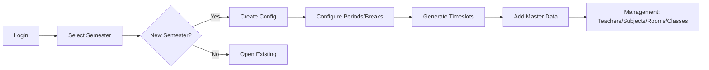
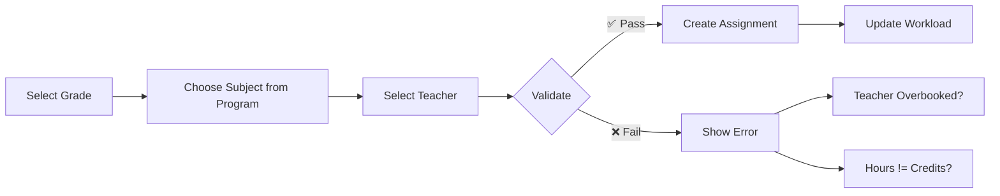
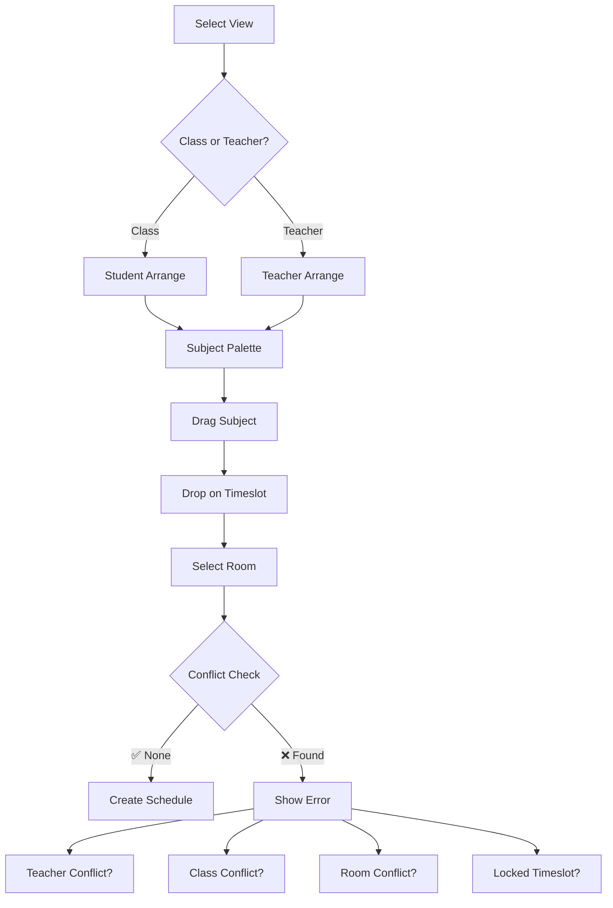
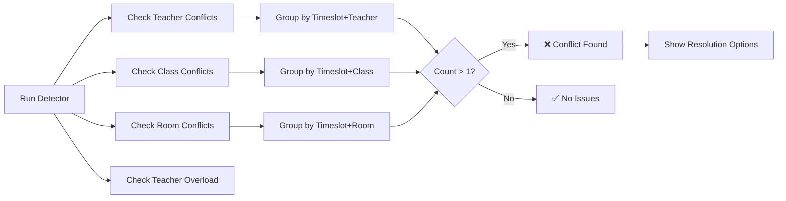
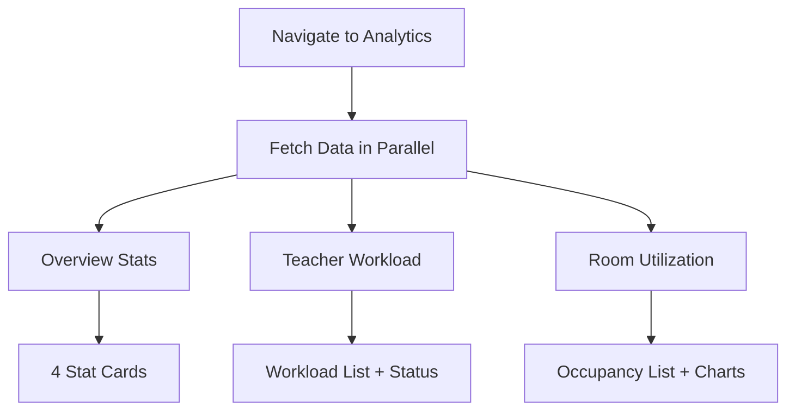
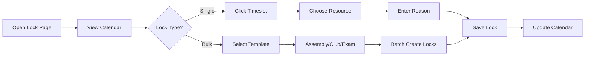
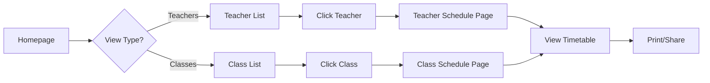

# User Flows Visual Summary - SubSentinel

**Quick Reference Guide**  
**Version:** 1.0 | **Last Updated:** January 2025

> 📖 **Full Documentation:** See memory `comprehensive_user_flows` for complete details

---

## 🎯 System Overview

**Purpose:** School timetable management for Thai secondary schools (ม.1-6)  
**Stack:** Next.js 16, Prisma 6.18, MUI 7.3, Auth.js 5, Tailwind 4.1  
**Architecture:** Clean Architecture + Server Actions + ActionResult<T>

**User Roles:**

- 🔐 **Admin** - Full access (authenticated)
- 👨‍🏫 **Teacher** - View own schedule (public)
- 🎓 **Student** - View class schedule (public)
- 👤 **Public** - Browse schedules (no auth)

---

## 🗺️ Site Map

```
📁 Public (No Auth Required)
├─ / - Homepage (teacher/class search)
├─ /teachers/[id] - Teacher schedule view
└─ /classes/[gradeId] - Class schedule view

🔐 Admin (Google OAuth)
├─ /login - Google sign-in
├─ /dashboard/select-semester - Choose term
│
├─ 📊 Dashboard & Analytics
│   ├─ /dashboard/[term] - Overview stats
│   ├─ /dashboard/[term]/analytics - Data visualization ✨NEW
│   ├─ /dashboard/[term]/teacher-table - Teacher schedules
│   ├─ /dashboard/[term]/student-table - Class schedules
│   ├─ /dashboard/[term]/all-timeslot - Master grid
│   ├─ /dashboard/[term]/all-program - Curriculum
│   └─ /dashboard/[term]/conflicts - Conflict detection
│
├─ 🛠️ Management (CRUD)
│   ├─ /management/teacher - Teachers
│   ├─ /management/subject - Subjects
│   ├─ /management/rooms - Rooms
│   ├─ /management/gradelevel - Classes
│   └─ /management/program - Programs
│
└─ 📅 Schedule Operations
    ├─ /schedule/[term]/config - Setup periods/breaks
    ├─ /schedule/[term]/assign - Assign subjects to classes
    ├─ /schedule/[term]/arrange/student-arrange - Drag-and-drop (class view)
    ├─ /schedule/[term]/arrange/teacher-arrange - Drag-and-drop (teacher view)
    └─ /schedule/[term]/lock - Lock timeslots
```

---

## 🔄 Core Workflows

### 1️⃣ Semester Setup (Admin)



**Key Steps:**

1. 🔐 **Login** via Google OAuth
2. 🗓️ **Create Config** (semester/year/periods/breaks)
3. ⚙️ **Generate Timeslots** (auto-created from config)
4. 📋 **Add Master Data:**
   - Teachers (with MaxHours)
   - Subjects (with Credits)
   - Rooms (with Capacity)
   - Classes (with Programs)
5. 📚 **Define Programs** (curriculum tracks)

---

### 2️⃣ Subject Assignment (Admin)



**Validation Rules:**

- ✅ Subject must be in grade's program
- ✅ NumberOfHours = Subject.Credits
- ✅ Teacher total hours ≤ MaxHours
- ✅ No duplicate assignment (GradeID + SubjectID + TeacherID unique)

**Example:**

```
Grade: ม.1/1
Subject: Math (2 credits)
Teacher: สมชาย (MaxHours=20, Current=12)
NumberOfHours: 2
Result: ✅ Valid (8 hours remaining)
```

---

### 3️⃣ Schedule Arrangement (Admin)



**Conflict Types:**

1. **🚨 Teacher Conflict** - Teaching 2 classes at same time
2. **🚨 Class Conflict** - 2 subjects at same time
3. **🚨 Room Conflict** - Room used by 2 classes
4. **🔒 Locked Timeslot** - Special event scheduled

**Visual Features:**

- 🎨 Color-coded subjects
- 📊 Progress bars (remaining slots)
- 🔴 Red borders for conflicts
- ✅ Green checkmarks for complete
- 🔄 Real-time validation

---

### 4️⃣ Conflict Detection (Admin)



**Conflict Display:**

```
🚨 ครูสอน 2 ชั้นพร้อมกัน
- ครู: นาย สมชาย (10001)
- คาบ: วันจันทร์ คาบ 3 (09:40-10:30)
- ชั้นเรียน: ม.1/1 (ท21101), ม.2/3 (ค21101)
[ปุ่ม: แก้ไข]
```

---

### 5️⃣ Analytics Dashboard (Admin) ✨NEW



**3 Sections (Phase 1 Complete):**

#### Section 1: Overview

- 📊 Total Scheduled Hours
- ✅ Completion Rate
- 👨‍🏫 Active Teachers
- 🚨 Conflicts Count

#### Section 2: Teacher Workload

- Sorted by hours (descending)
- Status chips:
  - 🟢 เหมาะสม (40-70% MaxHours)
  - 🟠 สูง (70-100%)
  - 🔴 สูงเกินไป (>100%)
  - ⚪ ใช้งานต่ำ (<40%)
- Visual progress bars

#### Section 3: Room Utilization

- Sorted by occupancy rate
- Status chips:
  - 🔴 ≥80% (Overutilized)
  - 🟢 60-79% (Optimal)
  - 🟡 40-59% (Moderate)
  - 🔵 20-39% (Underutilized)
  - ⚪ <20% (Barely used)
- Optional day breakdown

**Future Phases:**

- Phase 2: Subject Distribution, Quality Metrics, Time Analysis, Compliance
- Phase 3: Recharts visualizations (bar/pie/line charts)
- Phase 4: Filtering, export, date ranges

---

### 6️⃣ Schedule Locking (Admin)



**Lock Templates:**

- 🎤 **Assembly:** MON period 1 (all classes)
- 🏃 **Club Activities:** FRI periods 9-10 (all classes)
- 📝 **Exam Week:** All periods all days (selected classes)

**Lock Effect:**

- 🔒 Locked cells show lock icon
- ❌ Cannot drag subjects to locked cells
- ⚠️ Existing schedules show warning

---

### 7️⃣ Public Viewing (No Auth)



**Features:**

- 🔍 Search by name/ID
- 🔽 Sort by columns
- 📄 Pagination (20/page)
- 🖨️ Print-friendly view
- 📱 Responsive design

---

## 🧩 Data Model Quick Reference

### Core Entities

**Config** (Semester)

- `ConfigID` (PK): "1-2567" (SEMESTER-YEAR)
- `NumberOfPeriod`: 10 periods/day
- `TimePerPeriod`: 50 minutes
- `Break`: JSON array [{after: 4, duration: 20}]
- `SchoolDays`: JSON ["MON","TUE","WED","THU","FRI"]

**Teacher**

- `TeacherID` (PK): "10001"
- `Name`, `Surname`
- `MaxHours`: 18-25 typical
- Relation: `assigned_subject[]`, `classschedule[]`

**Subject**

- `SubjectID` (PK): "ท21101"
- `Name_TH`, `Name_EN`
- `Credits`: 0.5, 1.0, 1.5, 2.0
- `Category`: "พื้นฐาน", "เพิ่มเติม", "กิจกรรม"
- `Color`: Hex code for UI

**Room**

- `RoomID` (PK): "A101", "LAB1"
- `Capacity`: 20-50 students
- `RoomType`: "ห้องเรียน", "ห้องปฏิบัติการ"

**GradeLevel** (Class)

- `GradeID` (PK): "1-1" (ม.1/1)
- `Level`: 1-6
- `Section`: Room number
- `ProgramID` (FK): Curriculum track

**Program** (Curriculum)

- `ProgramID` (PK): "SCI-MATH"
- `ProgramName`: "วิทยาศาสตร์-คณิตศาสตร์"
- `Track`: "วิทย์-คณิต"
- Relation: `program_subject[]` (junction with subjects)

**Timeslot**

- `TimeslotID` (PK): "1-2567-MON1"
- Format: `{ConfigID}-{Day}{Period}`
- `StartTime`, `EndTime`: "08:00", "08:50"
- Auto-generated from config

**Assigned_Subject** (Assignment)

- Junction: GradeID + SubjectID + TeacherID
- `NumberOfHours`: Must equal subject.Credits
- Validates teacher not overbooked

**ClassSchedule** (Schedule Entry)

- Links: Grade + Subject + Teacher + Room + Timeslot
- Validates: No conflicts (class/teacher/room)

**Locked_Resource** (Lock)

- `ResourceType`: "CLASS", "TEACHER", "ROOM"
- `Reason`: "ชุมนุม", "สอบกลางภาค", etc.

---

## 🎨 UI Patterns

### Color Coding

**Subject Categories:**

- 🔵 Blue - Core subjects (พื้นฐาน)
- 🟢 Green - Elective subjects (เพิ่มเติม)
- 🟡 Yellow - Activity subjects (กิจกรรม)

**Status Indicators:**

- ✅ Green - Complete, optimal, no conflicts
- 🟡 Yellow - Partial, moderate, warnings
- 🔴 Red - Conflicts, overbooked, critical
- ⚪ Gray - Empty, unused, low
- 🔵 Blue - Informational

**Workload Levels:**

- 🟢 Green (40-70%) - เหมาะสม (Optimal)
- 🟠 Orange (70-100%) - สูง (High)
- 🔴 Red (>100%) - สูงเกินไป (Excessive)
- ⚪ Gray (<40%) - ใช้งานต่ำ (Low)

---

## 🧪 Testing Strategy

### Unit Tests (`__test__/`)

- Pure functions (validation, calculation)
- Repository methods (mocked Prisma)
- Business rules
- Table-driven tests

**Example:**

```typescript
describe("validateTeacherWorkload", () => {
  it("should reject when exceeding MaxHours", () => {
    const result = validateTeacherWorkload(
      { MaxHours: 18, CurrentHours: 17 },
      { NumberOfHours: 3 },
    );
    expect(result.valid).toBe(false);
  });
});
```

### E2E Tests (`e2e/`)

- Critical user flows
- Cross-role scenarios
- Uses seeded data (1-2567, 2-2567, 1-2568)

**Example:**

```typescript
test("Admin can assign subject to class", async ({ page }) => {
  await page.goto("/schedule/1-2567/assign");
  await page.click("text=+ มอบหมายวิชา");
  await page.selectOption('[name="GradeID"]', "1-1");
  await page.selectOption('[name="SubjectID"]', "ท21101");
  await page.click('button[type="submit"]');
  await expect(page.locator("text=บันทึกสำเร็จ")).toBeVisible();
});
```

**Run Commands:**

```bash
pnpm test           # Unit tests
pnpm test:e2e       # E2E local
pnpm test:vercel    # E2E production
```

---

## 🔐 Business Rules Checklist

### ✅ Hard Constraints (MUST NOT violate)

- [ ] Class cannot have 2 subjects at same time
- [ ] Teacher cannot teach 2 classes at same time
- [ ] Room cannot be used by 2 classes at same time
- [ ] Teacher cannot exceed MaxHours
- [ ] Cannot schedule during locked timeslots
- [ ] NumberOfHours must equal subject.Credits
- [ ] ConfigID is immutable once created
- [ ] ConfigID format: `/^[1-3]-\d{4}$/`

### 💡 Soft Constraints (SHOULD avoid)

- [ ] Minimize gaps in teacher's schedule
- [ ] Distribute subjects evenly across week
- [ ] Assign lab rooms to science subjects
- [ ] Keep same subject on alternating days
- [ ] Balance teacher workload (70-90% utilization)
- [ ] Room utilization 60-80% is optimal

### 📜 Ministry Standards (Thailand)

- [ ] Core subjects: Minimum credits per year
- [ ] Total credits: ~20 per semester
- [ ] Activity subjects: 1 credit minimum
- [ ] Grade levels: ม.1-6 (grades 7-12)
- [ ] School days: Monday-Friday (5 days)

---

## 🚀 Quick Start for New Admins

### First-Time Setup (3 days)

**Day 1: Configuration**

1. Login with Google OAuth
2. Create new semester (1-2568)
3. Configure: 10 periods, 50 min/period, break after period 4
4. Verify 50 timeslots generated

**Day 2: Master Data**

1. Import/add 80 teachers (CSV or manual)
2. Import/add 50 subjects
3. Add 10 rooms
4. Create 40 classes (ม.1/1 through ม.6/8)
5. Define 3 programs (วิทย์-คณิต, ศิลป์-คำนวณ, ศิลป์-ภาษา)
6. Assign subjects to programs

**Day 3: Assignment & Arrangement**

1. Assign subjects to all 40 classes
2. Verify no teacher exceeds MaxHours
3. Lock assembly time (MON period 1)
4. Lock club activities (FRI periods 9-10)
5. Drag-and-drop schedule all classes
6. Run conflict detection → Fix conflicts
7. Review analytics → Verify balance
8. Publish schedule

**Total Time:** 2-3 days for 40 classes, 80 teachers, 50 subjects

---

## 🎯 Common User Journeys

### Journey 1: New Semester

**Admin → Login → Create Config → Add Data → Assign → Arrange → Publish**  
**Time:** 2-3 days  
**Result:** Complete published schedule

### Journey 2: Mid-Semester Adjustment

**Admin → Select Semester → Edit Assignment → Rearrange → Fix Conflicts**  
**Time:** 30-60 minutes  
**Result:** Updated schedule with teacher change

### Journey 3: Teacher Views Own Schedule

**Teacher → Open Email Link → Public Page → View Timetable → Print**  
**Time:** 2 minutes  
**Result:** Personal schedule printed

### Journey 4: Parent Checks Child's Schedule

**Parent → Homepage → Search Class → View Schedule → Share Link**  
**Time:** 3 minutes  
**Result:** Class schedule viewed and shared

---

## 📊 Key Metrics

### System Capacity

- **Teachers:** 100+ (tested with 80)
- **Classes:** 50+ (tested with 40)
- **Subjects:** 100+ (tested with 50)
- **Timeslots:** 50 per semester (10 periods × 5 days)
- **Schedules:** 2,000+ entries (40 classes × 50 timeslots)

### Performance

- **Page Load:** < 2 seconds (with SSR)
- **Conflict Detection:** < 1 second (for 2,000 schedules)
- **Drag-and-Drop:** Real-time (optimistic UI)
- **Analytics:** < 3 seconds (parallel queries)

### Code Stats (Jan 2025)

- **Total Lines:** 20,000+
- **Features:** 16 modules
- **Server Actions:** 50+
- **Components:** 100+
- **Routes:** 25+ pages

---

## 🆘 Troubleshooting

### Issue: Teacher appears overbooked

**Solution:** Check analytics → Teacher Workload section → Verify MaxHours vs. actual assignments

### Issue: Conflict not auto-detected

**Solution:** Navigate to Conflicts page → Click "Refresh" → Review all conflict types

### Issue: Cannot drag subject to timeslot

**Check:**

1. Is timeslot locked? (🔒 icon visible?)
2. Does subject have remaining slots? (Counter > 0?)
3. Is there a conflict? (Red border on drop?)

### Issue: Public page not showing schedule

**Check:**

1. Is config.status = "PUBLISHED"?
2. Has schedule been created for this class/teacher?
3. Clear browser cache and refresh

### Issue: Login not working

**Check:**

1. Is email in authorized admin list? (see `src/auth.ts`)
2. Is Google OAuth configured correctly?
3. Check browser console for errors

---

## 📚 Related Documentation

- 📖 **Full User Flows:** Memory `comprehensive_user_flows` (detailed flow diagrams)
- 📊 **Data Model:** Memory `data_model_business_rules` (schema, validation)
- 🏗️ **Architecture:** Memory `project_overview` (tech stack, patterns)
- 🎨 **Code Style:** Memory `code_style_conventions` (formatting, naming)
- ✅ **Testing:** `docs/E2E_TEST_SETUP_COMPLETE.md`, `docs/E2E_TEST_EXECUTION_GUIDE.md`
- 🚀 **Deployment:** `DEPLOYMENT.md`, `QUICKSTART_TEST_MIGRATION.md`
- 📝 **Migrations:** `PRISMA_MIGRATION.md`, `docs/COMPLETE_MIGRATION_SUMMARY.md`

**MCP Servers:**

- **Next DevTools:** Next.js 16 diagnostics, upgrades
- **Prisma MCP:** Schema reasoning, migrations
- **Serena:** Symbol-aware code navigation
- **context7:** Version-specific docs
- **GitHub MCP:** PR context

---

## 🎉 Recent Additions

### ✨ Analytics Dashboard (Jan 2025)

**Phase 1 Complete:**

- Overview Stats (4 cards)
- Teacher Workload Analysis (sorted list + status)
- Room Utilization Analysis (occupancy rates)
- Total: 687 lines, 5 files
- Route: `/dashboard/[term]/analytics`

**Next Steps:**

- Phase 2: Subject/Quality/Time/Compliance sections
- Phase 3: Recharts visualizations
- Phase 4: Filtering and export

---

**Last Updated:** January 2025  
**Version:** 1.0  
**Maintained By:** AI Agent + Development Team

For detailed implementation guidance, always refer to memory `comprehensive_user_flows`.
