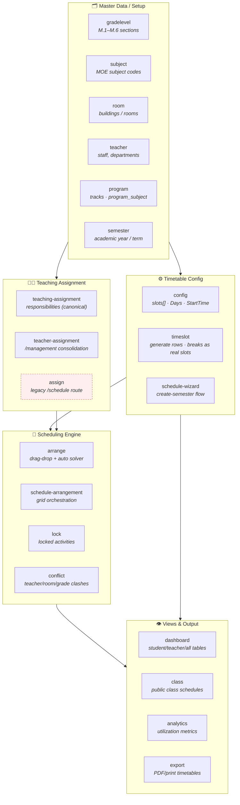
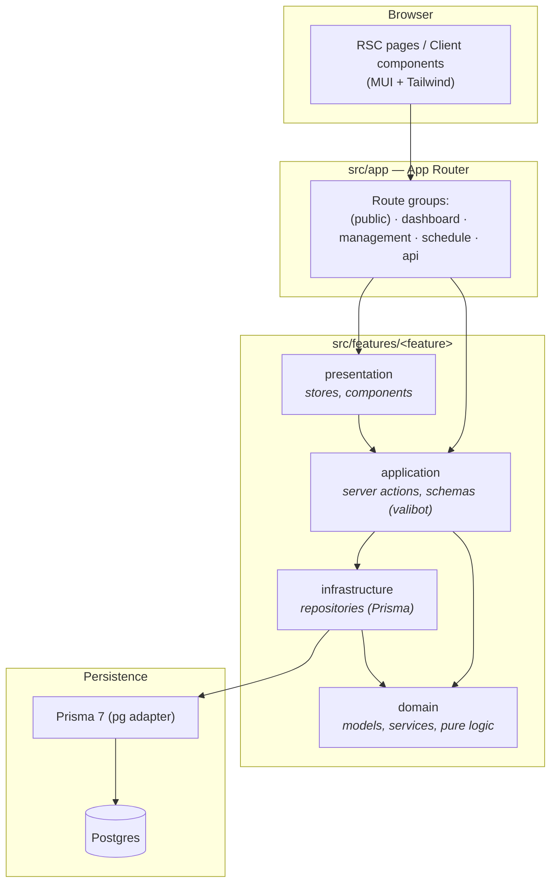
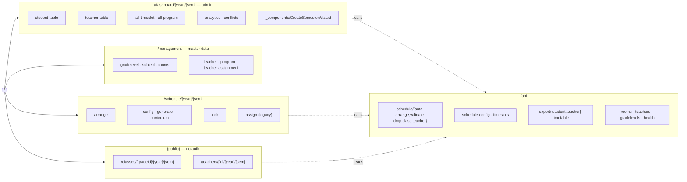
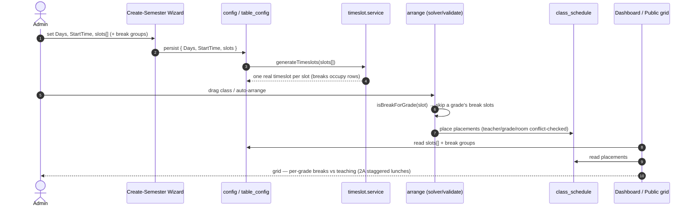
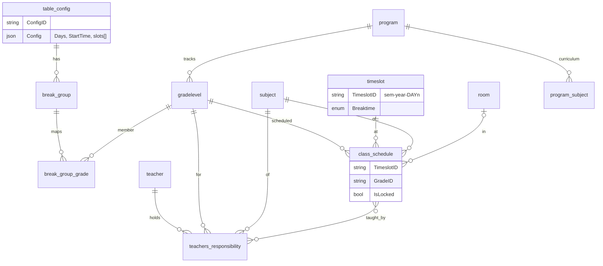

# Phrasongsa Timetable — Feature Map & Architecture Overview

> Next.js 16 (App Router, React 19 + reactCompiler) · Prisma 7 (pg adapter) · Postgres · Valibot · MUI + Tailwind · Vitest/Playwright. Thai secondary-school timetabling with MOE compliance. Feature-sliced architecture.

---

## 1. Feature Map (by domain area)

Legacy/in-migration (dashed): `assign` routes under `/schedule/.../assign` are being consolidated into `/management/teacher-assignment` (beads epic i8z, redirect lyw, cleanup 7xb).

---

## 2. Layered Architecture (feature-sliced)

Each feature folder follows the same internal layering; the dependency rule points inward (presentation → application → domain; infrastructure implements domain ports).

Shared/cross-cutting: `src/lib` (infrastructure repos, UI helpers like `break-rows`), `src/utils` (`break-utils`, `timeslot-id`), `src/components/schedule` (`TimeslotGrid`), `src/stores`, `src/hooks`, `src/shared`.

---

## 3. Route Map

---

## 4. Core Data Flow — config → schedule → view

---

## 5. Domain Model (key entities)

Phase 2A note: `table_config.Config.slots[]` (`{ duration, breakGroups? }`) replaced legacy `Duration`/`TimeslotPerDay`/`breakDefinitions`. Breaks are real `timeslot` rows; per-grade break-ness resolves via `break_group` / `break_group_grade`. A group's lunch slot is teaching-capable for other groups.
